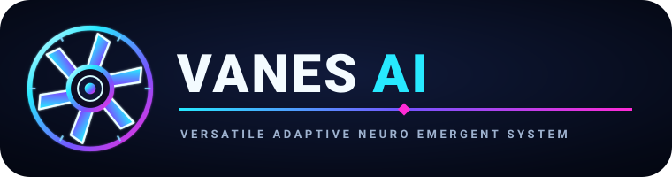

# VANES-AI V2 FOREX

  

> **Realtime Forex Intelligence Command Center** — market data, transparent signals, broker-aware risk references, paper trading, historical replay, MT5 bridge, local chatbot, multimodal cloud AI, and secure live-order dispatch for SERVER_A subscribers.

VANES-AI V2 is a market-analysis and paper-trading observer for MetaTrader 5. It can optionally capture microphone audio and MT5 screen frames, aggregate them into secure packets, and send them to a Cloudflare-backed AI gateway for multimodal analysis. SERVER_A tier subscribers receive live order dispatch instructions that can be executed via the MT5 Python API.

## Realtime command center

Start VANES with `python -m vanes.app`, then open **http://127.0.0.1:8765/chat**. The browser command center refreshes live market state every second and lets you ask VANES about the quote, signal, indicators, structure, risk, paper account, and reasons for WAIT.

Example questions:

- `What is EURUSD doing?`
- `What is the signal?`
- `Show indicators`
- `Why wait?`
- `Show risk`
- `Paper P/L`

The chatbot is deliberately read-only and cannot place broker orders.

## V0.2 capabilities

- Read-only MetaTrader 5 quotes and OHLCV candles.
- EMA, RSI and ATR indicators.
- Trend, market structure, support and resistance analysis.
- Multi-timeframe confirmation.
- Spread filtering.
- Reference stop-loss, take-profit and position sizing.
- Daily loss-limit calculations.
- Append-only JSONL audit trail.
- Paper-trading account simulation with daily loss protection.
- Localhost JSON bridge for the MT5 chart panel.
- Always-on-top desktop observer.
- Automated unit tests and GitHub Actions CI.

## Installation

Python 3.10+ is required.

Core/CI dependencies:

    python -m pip install -r requirements.txt

For live MetaTrader 5 data on Windows with MT5 installed:

    python -m pip install -r requirements-mt5.txt

Start the observer:

    python -m vanes.app

MetaTrader 5 must be running for live quotes and candles.

## Configuration

Defaults can be overridden with environment variables:

    VANES_SYMBOL=EURUSD
    VANES_TIMEFRAME=M15
    VANES_CONFIRMATION_TIMEFRAME=H1
    VANES_ACCOUNT_BALANCE=10000
    VANES_RISK_PERCENT=1
    VANES_MAX_DAILY_LOSS_PERCENT=3
    VANES_MAX_SPREAD_POINTS=25
    VANES_AUDIT_PATH=data/vanes_audit.jsonl
    VANES_DRY_RUN=1

VANES_DRY_RUN is retained as a safety setting. This release contains no broker-order implementation.

## MT5 chart panel

Open MetaEditor and compile:

    mt5/VANES_Bridge.mq5

Attach it to a chart. In MetaTrader 5, add this allowed WebRequest URL:

    http://127.0.0.1:8765

The panel reads the local Python state endpoint. It does not place, modify, or close trades.

## Paper trading

Paper trading is an internal simulation only. It never calls an MT5 trade API. The simulator tracks balance, realized P/L, open/closed simulated trades and a daily loss limit.

The desktop observer does not automatically enter paper positions. This is intentional: the first paper release is non-invasive. The PaperTrader class can be driven by a future backtest/replay workflow.

## Quick start

### Windows / MetaTrader 5

1. Install Python 3.10+ and MetaTrader 5.
2. Install dependencies: `python -m pip install -r requirements.txt`.
3. Install MT5 support: `python -m pip install -r requirements-mt5.txt`.
4. Start: `python -m vanes.app`.
5. Open `http://127.0.0.1:8765/chat`.
6. For the MT5 chart panel, allow `http://127.0.0.1:8765` under WebRequest settings.

### Safety defaults

- `VANES_DRY_RUN=1` by default.
- No broker trade API is called by the current application.
- The HTTP bridge binds to localhost.
- Chat commands are informational only.
- Risk calculations are references, not an authorization to trade.

## Testing

Run:

    python -m unittest discover -s tests -v
    python -m compileall -q vanes tests
    pylint vanes

GitHub Actions runs syntax checks, unit tests and Pylint on Python 3.10, 3.11 and 3.12.

## Architecture

    +-----------------------+      +-----------------------+      +-----------------------+
    |  USER MICROPHONE FEED |      |   OS WINDOW MONITOR   |      |  LOCAL OVERLAY CLIENT |
    |  "What's the status?" |      |  (MetaTrader 5 Screen)|      |  (PyQt6 / Electron UI)|
    +-----------+-----------+      +-----------+-----------+      +-----------+-----------+
                |                              |                              |
                v                              v                              |
      [Audio Capture Buffer]         [Screen Capture Frame]                   |
                |                              |                              |
                +---------------+--------------+                              |
                                |                                             |
                                v                                             |
                  +───────────────────────────+                               |
                  | Local Client Aggregator   |                               |
                  | Packets Encapsulation     |                               |
                  +─────────────+─────────────+                               |
                                |                                             |
                                |  HTTPS POST (With User Account JWT Token)   |
                                v                                             |
                  +───────────────────────────+                               |
                  | Cloud API Edge Gateway    |                               |
                  | (Token Check & Paywall)   |                               |
                  +─────────────+─────────────+                               |
                                |                                             |
                ┌─────────────────┴─────────────────┐                           |
                ▼                                   ▼                           |
      [Token Rejected: 402/401]          [Token Verified: Valid User]          |
                │                                   │                           |
                ▼                                   v                           |
      (Return Error JSON)             +───────────────────────+               |
                │                       | Server Tier Router    |               |
                │                       | (A, B, or C Ruleset)  |               |
                │                       +───────────+───────────+               |
                │                                   |                           |
                │                                   v                           |
                │                       +───────────────────────+               |
                │                       | Gemini 2.5 MultiModal |               |
                │                       | (Image + Text Logic)  |               |
                │                       +───────────+───────────+               |
                │                                   |                           |
                │                                   v                           |
                │                       +───────────────────────+               |
                │                       | Formatted JSON Return |               |
                │                       +───────────+───────────+               |
                │                                   |                           |
                v                                   v                           |
    +─────────────────────────────────────────────────────────────────────────+-----------+
    |                          SECURE INTER-PROCESS CLIENT PIPELINE                       |
    +─────────────────────────────────────────────────────────────────────────+-----------+
                  │                                   │
                  ▼                                   ▼
    [Display Red Error Banner]         [Render Transparent Alert Text Notification Overlay]
                                                  │
                                                  ▼
                                     { IF SUBSCRIPTION TIER == "SERVER_A" }
                                                  │
                                                  ▼
                                     +─────────────────────────+
                                     | MetaTrader 5 Python API |
                                     |  (Live Order Dispatched)|
                                     +─────────────────────────+

- **Local capture** (`vanes/capture.py`) captures microphone audio and MT5 screen frames when enabled via `VANES_CAPTURE_AUDIO=1` and `VANES_CAPTURE_SCREEN=1`.
- **Aggregator** (`vanes/aggregator.py`) encapsulates audio, screen, and market state into compact packets.
- **Secure client** (`vanes/jwt_client.py`) authenticates with short-lived JWTs and sends packets to the Cloud API Edge Gateway.
- **Cloudflare Worker** (`cloudflare/src/index.js`) verifies JWT tokens, enforces subscription tiers, and routes requests.
- **Gemini 2.5** multimodal analysis runs server-side for SERVER_A and SERVER_B tiers.
- **Overlay UI** (`vanes/ui.py`) shows live analysis, error banners, and transparent alert notifications.
- **Live trader** (`vanes/trader.py`) dispatches MT5 orders only for SERVER_A tier with explicit user consent.

## Multimodal pipeline

When enabled, VANES captures two local streams:

1. **Microphone audio** — captured in 2-second chunks at 16 kHz mono PCM, base64-encoded into packets.
2. **MT5 screen frames** — captured at 1 FPS by default, optimized to JPEG if the PNG exceeds the packet size limit.

Both streams are aggregated with the latest market state and sent to the Cloud API Edge Gateway over HTTPS with a JWT bearer token.

## Subscription tiers

| Tier | Multimodal | AI Analysis | Live Orders |
|------|-----------|-------------|-------------|
| SERVER_A | Full audio + screen | Gemini 2.5 | Yes (MT5) |
| SERVER_B | Full audio + screen | Gemini 2.5 | No |
| SERVER_C | Text only | Basic rules | No |

Set the tier with:

    VANES_SUBSCRIPTION_TIER=SERVER_A

## Secure inter-process pipeline

- **JWT authentication** — every cloud request carries a short-lived HMAC-SHA256 JWT signed with `VANES_JWT_SECRET`.
- **Token verification** — the Cloudflare Worker rejects expired or invalid tokens with HTTP 401.
- **Paywall enforcement** — when `VANES_PAYWALL=1`, SERVER_A requests return HTTP 402 until payment is confirmed.
- **Error banners** — the desktop overlay shows red error banners for 401/402/network failures.
- **Transparent alerts** — success notifications and AI analysis summaries appear as transient overlay text.

## Cloud configuration

To enable the multimodal pipeline, set these environment variables:

    VANES_CLOUD_URL=https://your-worker.workers.dev
    VANES_CLOUD_TOKEN=your-publish-token
    VANES_JWT_SECRET=your-jwt-secret
    VANES_SUBSCRIPTION_TIER=SERVER_B
    VANES_GEMINI_API_KEY=your-gemini-key

Optional capture settings:

    VANES_CAPTURE_AUDIO=1
    VANES_CAPTURE_SCREEN=1
    VANES_CAPTURE_AUDIO_DEVICE=default
    VANES_CAPTURE_SCREEN_REGION=0,0,1920,1080
    VANES_CAPTURE_AUDIO_CHUNK_SECONDS=2.0
    VANES_CAPTURE_SCREEN_FPS=1
    VANES_CAPTURE_MAX_PACKET_BYTES=524288

## Live MT5 orders (SERVER_A only)

When `VANES_SUBSCRIPTION_TIER=SERVER_A` and the cloud gateway returns `order_dispatch=READY`, the local `MT5Trader` can place and close live positions. This requires:

1. MetaTrader 5 running with automated trading enabled.
2. The Python `MetaTrader5` package installed.
3. `VANES_DRY_RUN=0` (orders are placed only when dry run is disabled).

Order flow:
- Cloud Gemini analysis returns `direction`, `confidence`, `reason`.
- The local client evaluates risk gates and symbol specs.
- `MT5Trader.place_order()` sends a market order with SL/TP to the broker.
- Positions are tracked and can be closed via `close_position_by_ticket()`.

**Safety boundary:** Live orders are only dispatched for SERVER_A tier and only after explicit configuration. The default remains `VANES_DRY_RUN=1` (no orders).

## Safety boundary

VANES-AI V2 currently has no automatic broker order execution. It is designed to inform the user and record paper-analysis results. Any future live-order module should be separately designed, tested, permissioned and disabled by default.

## Historical backtesting

VANES includes a deterministic candle-replay engine in `vanes/backtest.py`.

The replay engine:

- Uses only candles available before each signal (no look-ahead).
- Evaluates the existing `RuleBasedStrategy`.
- Enters at the next candle open after a signal.
- Builds SL/TP from ATR using the same risk-plan logic as the observer.
- Exits at stop or target; if both are touched in one candle, stop is treated as first for a conservative result.
- Closes any remaining position at the final candle close.
- Reports net P/L, return, trade count, wins/losses, win rate, gross profit/loss, profit factor and maximum drawdown.
- Never submits broker orders.

Example:

    from vanes.backtest import BacktestConfig, run_backtest

    report = run_backtest(
        candles,
        config=BacktestConfig(
            starting_balance=10000,
            risk_percent=1,
            value_per_price_unit=1,
        ),
    )

    print(report.net_pnl, report.max_drawdown, report.win_rate_percent)

`value_per_price_unit` is deliberately explicit because real FX cash-per-price-unit varies by broker, symbol and account currency. It must be calibrated from MT5 symbol metadata before treating a backtest as a broker-accurate P/L estimate.

The current engine is a single-symbol/single-timeframe replay. Multi-timeframe historical alignment and broker-accurate tick economics are separate hardening steps.

### Tick-accurate execution replay

`run_tick_backtest()` replays strategy execution against historical MT5 bid/ask ticks.

- Indicators use only candles strictly before each decision candle.
- BUY entries use ask and BUY exits use bid.
- SELL entries use bid and SELL exits use ask.
- Stops and targets are checked tick-by-tick, removing OHLC ordering ambiguity.
- `MT5Adapter.ticks()` loads historical bid/ask ticks with MT5 `copy_ticks_range()`.
- Broker tick size/value and volume constraints can be supplied through `BacktestConfig`.
- Commission is applied only when explicitly supplied.
- Swaps, historical slippage and changing broker contract settings are not invented.
### Forex accuracy boundary

For broker-accurate backtests, populate `BacktestConfig` with the MT5 symbol's `trade_tick_size`, `trade_tick_value`, `volume_min`, `volume_max`, and `volume_step` from `MT5Adapter.symbol_spec()`. The engine then sizes volume from actual cash risk instead of assuming one generic price-unit value.

Execution costs are explicit: `spread_price` models the quoted spread and `commission_per_lot` models commission. Historical OHLC candles do not contain historical bid/ask spreads, commissions, swaps, or tick-by-tick execution, so an OHLC-only backtest cannot honestly claim tick-level broker accuracy. For that level of accuracy, VANES must replay MT5 tick data and the broker's historical contract/symbol settings.

The backtester sorts MT5 candles chronologically, never uses future candles for a signal, and applies conservative stop-first handling when one OHLC candle touches both stop and target.

## Cloudflare deployment

VANES now includes a Cloudflare Worker command center under `cloudflare/`. This is the cloud web layer: it provides the browser dashboard, `/api/state`, `/api/health`, and `/api/chat`. The cloud chatbot is read-only and does not execute broker orders.

### Deploy

1. Install Node.js 18+.
2. `cd cloudflare`
3. `npm install`
4. `npx wrangler login`
5. `npx wrangler deploy`
6. Open the Worker URL printed by Wrangler.

### Live MT5 data

Cloudflare Workers cannot run the Python MetaTrader5 package or the desktop Tkinter application. Keep the Python/MT5 process running on a machine that has MT5, then publish sanitized latest state to the Worker KV namespace if you want live cloud data. The Worker intentionally starts in safe WAIT mode when no state is available.

This separation prevents a public web page from gaining direct broker access. Do not expose MT5 credentials or broker APIs to browser JavaScript.
